# Notes on Creation and Management
This folder contains notes used, and made when creating the VChat GUI program.

There are two avenues of developing the VChat GUI program. The first is creating the GUI application as a C++ program with [WinRT/Win GUI API 2](https://learn.microsoft.com/en-us/windows/uwp/cpp-and-winrt-apis/intro-to-using-cpp-with-winrt), and using C# (C-Sharp) as a Universal Windows Application, or more likely a WPF program.

When talking to Prof.Fu it was stressed this **needs** to be a C++ application.


1) C++ Application
   1) [Getting Started](https://learn.microsoft.com/en-us/windows/apps/winui/winui2/getting-started)
   2) [Hello-World](https://learn.microsoft.com/en-us/windows/uwp/get-started/create-a-basic-windows-10-app-in-cppwinrt)
2) C# Application
   1) [Responsive Layouts](https://learn.microsoft.com/en-us/windows/apps/design/layout/layouts-with-xaml)
   2) [Hello-World](https://learn.microsoft.com/en-us/windows/uwp/get-started/create-a-hello-world-app-xaml-universal)
3) We may need to use a WPF application for access to system resources as UWP is sandboxed.
   1) [Getting Started](https://learn.microsoft.com/en-us/visualstudio/get-started/csharp/tutorial-wpf?view=vs-2022)
   2) [Walkthroughs](https://learn.microsoft.com/en-us/dotnet/desktop/wpf/getting-started/wpf-walkthroughs?view=netframeworkdesktop-4.8)
4) C++ WinForm application
   1) [Directory](https://learn.microsoft.com/en-us/cpp/dotnet/dotnet-programming-with-cpp-cli-visual-cpp?view=msvc-170)

## Todo

* [x] Hello World Type of Example
* [x] Create Process Functionality
  * [x] Test Startup
  * [x] Test Stop
* [x] Pipe Functionality
  * [x] Create Test Child Executable
  * [x] Test Read
    * This needed to use an explicit call to `WriteFile(hStdout, buff, strlen(buff), &dwWritten, NULL);` for it to work, Need to look into a workaround.
  * [ ] Test Write
* [X] Create Mutex For Sync
  * [X] Test Read From Pipe
  * [ ] Test Write to Pipe
* [x] Create Thread for reading from Pipe
## Visual Studio Setup
1) Install [Visual Studio](https://visualstudio.microsoft.com/) 
2) Install the [Desktop Development With C++](https://learn.microsoft.com/en-us/cpp/build/vscpp-step-0-installation?view=msvc-170#:~:text=For%20core%20C%20and%20C%2B%2B%20support%2C)

   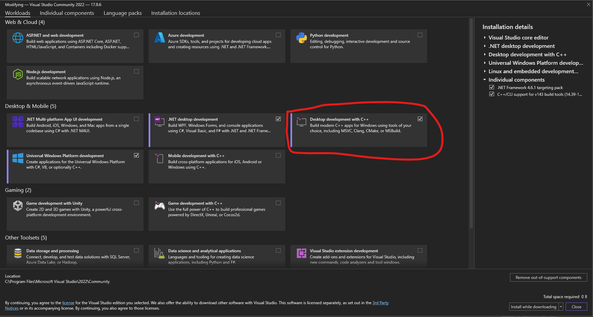

3) In Individual Components install [C++/CLI support](https://learn.microsoft.com/en-us/cpp/dotnet/dotnet-programming-with-cpp-cli-visual-cpp?view=msvc-170)

   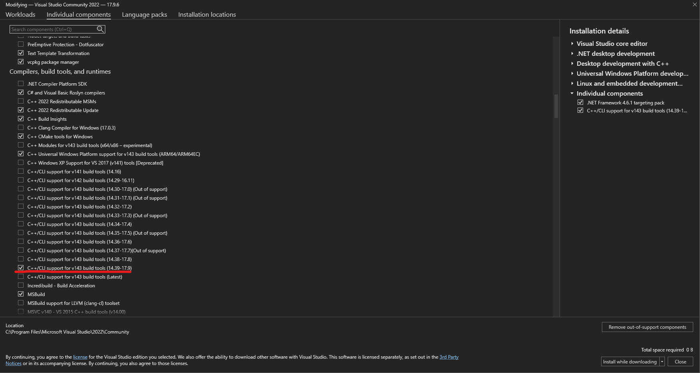

4. Click *Create a new project*

   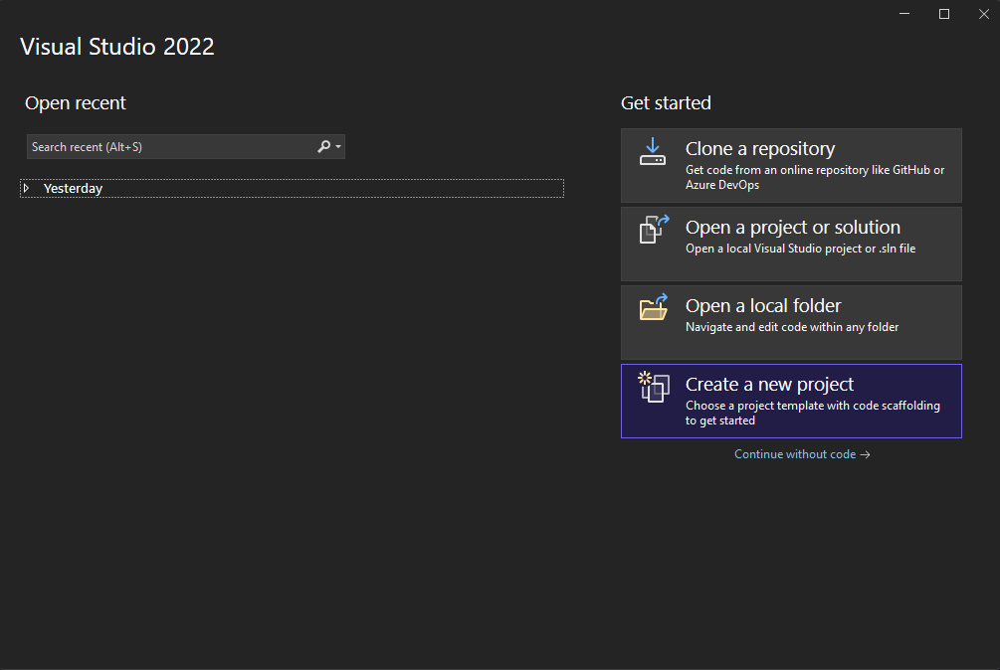

5. Select the **CRL Empty Project**

   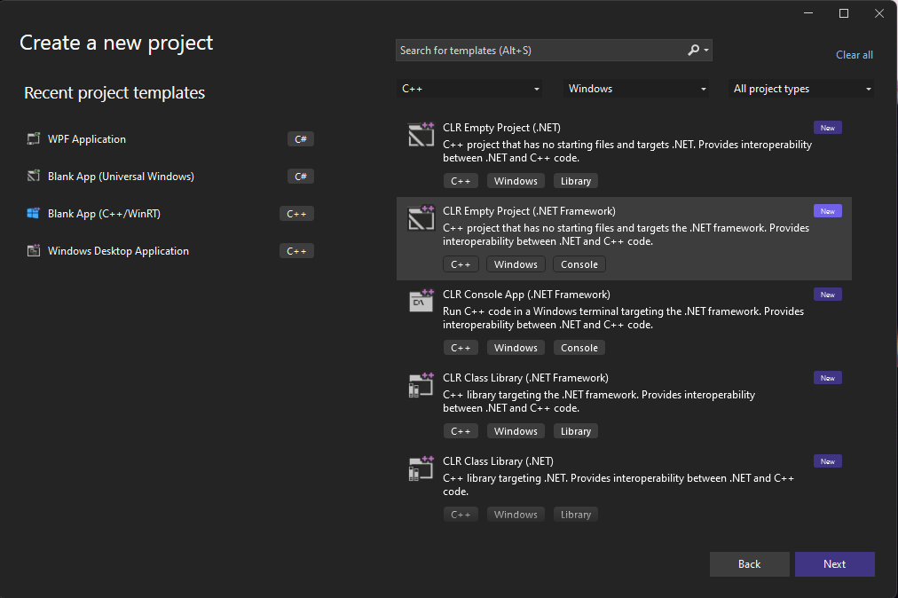

6. Provide a name and location to store the application

   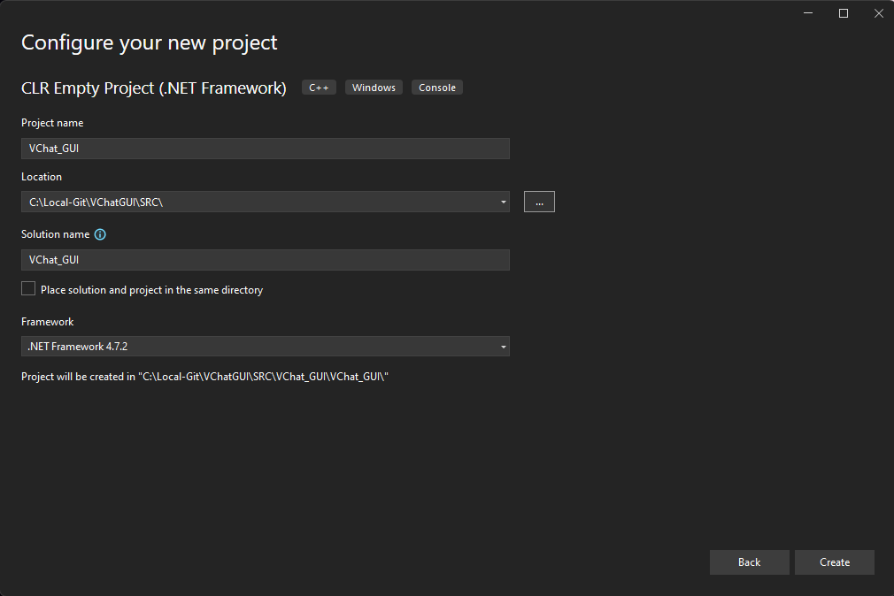

7. On a successful creation you should see a mostly empty project

   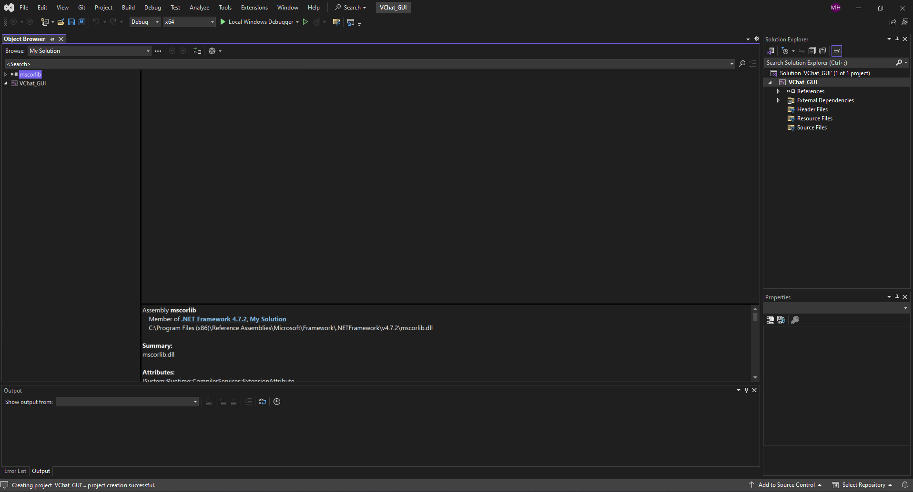

8. Update Properties
   1. Open the Project Properties window

      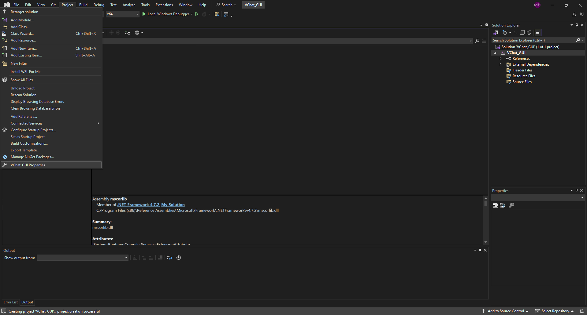

   2. In *Linker* -> *Advanced* specify the entrypoint to the program as *main*

      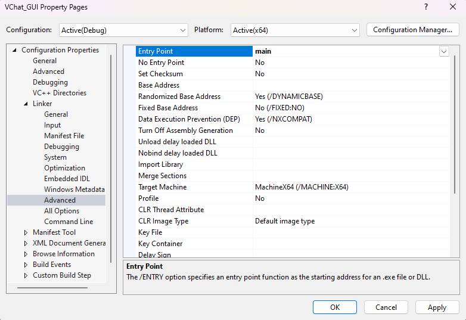

   3. You can modify other security features as desired.
9. Add a *Windows Forum* Component 
   1.  Open the *project* window again and click *Add New Item*

      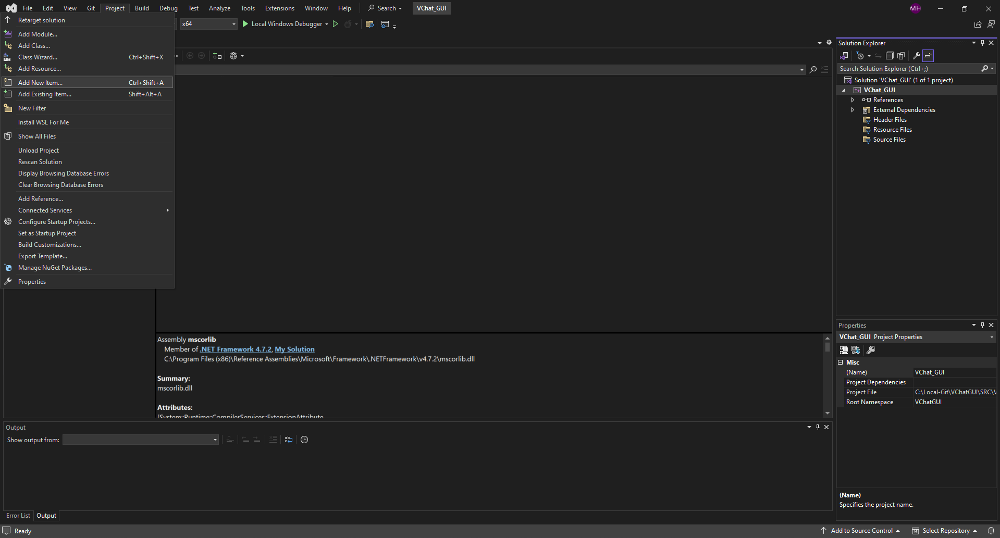

   2. Click *Show All Templates*

      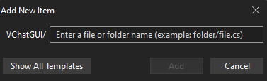

   3. Click *UI* and select *Windows Form*

      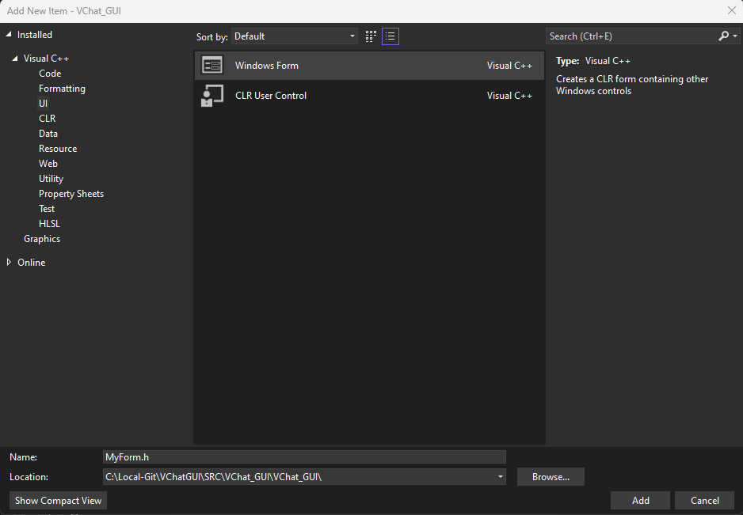

10. Now we will see the project has been populated with a number of files and directories.

   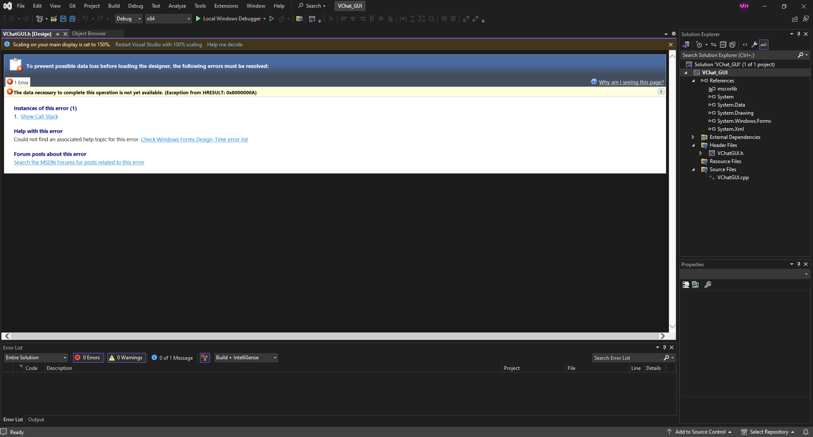
## Visual WinForm C++
1. In the main `.c` file add the following code. 
   ```cpp
   #include "VChatGUI.h"

   using namespace System;
   using namespace System::Windows::Forms;

   [STAThreadAttribute]

   void main(array<String^>^ args) {
      Application::SetCompatibleTextRenderingDefault(false);
      Application::EnableVisualStyles();
      VChatGUI::VChatGUI frm;
      Application::Run(% frm);
   }
   ```
   * `#include "VChatGUI.h"`: This includes the structure that is generated for your WindForm
   * `using namespace System`: Use the System namespace (Omit the System:: tag from instructions)
   * `using namespace System::Windows::Forms`: Use the `System::Windows::Forms` namespace
   * [`[STAThreadAttribute]`](https://learn.microsoft.com/en-us/dotnet/api/system.stathreadattribute?view=net-8.0): This specifies we will be using a [Single Threaded Apartment](https://learn.microsoft.com/en-us/windows/win32/com/single-threaded-apartments) design, where multiple threads communicate using a event or message passing scheme. This allows threads to wait on and execute once they have received an event.  

https://stackoverflow.com/questions/12184614/trigger-controls-event-programmatically#:~:text=To%20raise%20an%20event%20from%20outside%20the%20declaring,%7B%20public%20void%20ProgrammaticClick%28EventArgs%20e%29%20%7B%20base.OnClick%28e%29%3B%20%7D

I could always add a mutex, but inheriting the class and firing off an event is likely more sussinct if less explicit. 

https://stackoverflow.com/questions/1231774/why-public-ref-in-c-class-definition

## Server Manager Code
https://learn.microsoft.com/en-us/windows/win32/procthread/creating-a-child-process-with-redirected-input-and-output?redirectedfrom=MSDN
https://learn.microsoft.com/en-us/windows/win32/debug/retrieving-the-last-error-code
https://learn.microsoft.com/en-us/windows/win32/api/winbase/nf-winbase-formatmessage
https://learn.microsoft.com/en-us/windows/win32/api/processthreadsapi/ns-processthreadsapi-process_information
https://learn.microsoft.com/en-us/windows/win32/ipc/anonymous-pipe-operations


Thread:
https://learn.microsoft.com/en-us/dotnet/standard/threading/destroying-threads
https://learn.microsoft.com/en-us/dotnet/api/system.threading.thread?view=net-8.0
## Ref: 
Classic: https://stackoverflow.com/questions/12537456/how-to-append-text-to-a-textbox
