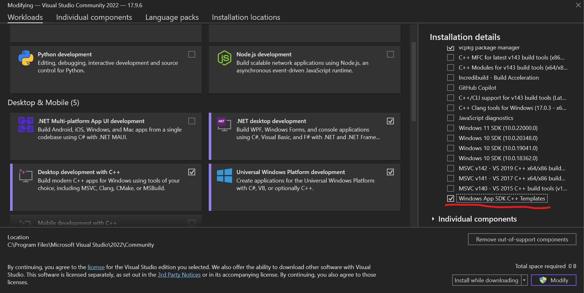

# Notes on Creation and Management
This folder contains notes used, and made when creating the VChat GUI program.

There are two avenues of developing the VChat GUI program. The first is creating the GUI application as a C++ program with [WinRT/Win GUI API 2](https://learn.microsoft.com/en-us/windows/uwp/cpp-and-winrt-apis/intro-to-using-cpp-with-winrt), and using C# (C-Sharp) as a Universal Windows Application, or more likely a WPF program. A overview of all frameworks can be found on [Microsoft's Website](https://learn.microsoft.com/en-us/windows/apps/get-started/?tabs=cpp-win32%2Cnet-maui#app-development-framework-feature-comparison).

When talking to Prof.Fu it was stressed this **needs** to be a C++ application.


1) C++ Application
   1) [Getting Started](https://learn.microsoft.com/en-us/windows/apps/winui/winui2/getting-started)
   2) [Hello-World](https://learn.microsoft.com/en-us/windows/uwp/get-started/create-a-basic-windows-10-app-in-cppwinrt)
2) C# Application
   1) [Responsive Layouts](https://learn.microsoft.com/en-us/windows/apps/design/layout/layouts-with-xaml)
   2) [Hello-World](https://learn.microsoft.com/en-us/windows/uwp/get-started/create-a-hello-world-app-xaml-universal)
3) We may need to use a WPF application for access to system resources as UWP is sandboxed.
   1) [Getting Started](https://learn.microsoft.com/en-us/visualstudio/get-started/csharp/tutorial-wpf?view=vs-2022)
   2) [Walkthroughs](https://learn.microsoft.com/en-us/dotnet/desktop/wpf/getting-started/wpf-walkthroughs?view=netframeworkdesktop-4.8)
4) C++ WinForm application
   1) [Directory](https://learn.microsoft.com/en-us/cpp/dotnet/dotnet-programming-with-cpp-cli-visual-cpp?view=msvc-170)

## Todo

* [x] Hello World Type of Example
* [x] Create Process Functionality
  * [x] Test Startup
  * [x] Test Stop
* [x] Pipe Functionality
  * [x] Create Test Child Executable
  * [x] Test Read
    * This needed to use an explicit call to `WriteFile(hStdout, buff, strlen(buff), &dwWritten, NULL);` for it to work, Need to look into a workaround.
  * [ ] Test Write
* [X] Create Mutex For Sync
  * [X] Test Read From Pipe
  * [ ] Test Write to Pipe
* [x] Create Thread for reading from Pipe

## Visual Studio Setup WinUI 3
A useful tool due to the lack of a visual designer will be the [WinUI 3 Gallery](https://apps.microsoft.com/detail/9p3jfpwwdzrc?hl=en-us&gl=US)

1) Install [Visual Studio](https://visualstudio.microsoft.com/)
2) Install the [Desktop Development With C++](https://learn.microsoft.com/en-us/cpp/build/vscpp-step-0-installation?view=msvc-170#:~:text=For%20core%20C%20and%20C%2B%2B%20support%2C)

   

3. Install WinUI Templates at the bottom of the Optional Section

   

4. Create an [*Unpackaged*](https://learn.microsoft.com/en-us/windows/apps/winui/winui3/create-your-first-winui3-app#unpackaged-create-a-new-project-for-an-unpackaged-c-or-c-winui-3-desktop-app) WinUI Project. This is so we can have full access to the system without running in a sandboxed environment.

### Create Unpackaged Project
1. Create a WinUI3 packaged project, we will modify the `.vcxproj` file to make it unpackaged.
2. Install [Windows App SDK](https://learn.microsoft.com/en-us/windows/apps/windows-app-sdk/downloads).
3. Install [Microsoft Visual C++ Redistributabl](https://learn.microsoft.com/en-us/cpp/windows/latest-supported-vc-redist?view=msvc-170)
4. Create a New WinUI Project, select *Blank App, Packaged (WinUI 3 in Desktop) project template*

5. Add the following to your `.vcxproj` file
   ```
   <Project ...>
   ...
   <PropertyGroup>
      ...
      <WindowsPackageType>None</WindowsPackageType>
      ...
   </PropertyGroup>
   ...
   </Project>
   ```
5. Add the following to your `.vcxproj` file
   ```
   <Project ...>
   ...
   <PropertyGroup Label="Globals">
      ...
      <AppxPackage>false</AppxPackage>
      ...
   </PropertyGroup>
   ...
   </Project>
   ```
6. Build and run

> [!NOTE]
> You must have the required DLLs for the C++ WinUI3 executable installed on the target system

### Implementation Notes

When Creating a background thread it can accesses member functions. But WinUI3 limits UI operations to the UI thread. So we need to marshal it to do anything. [Ref](https://learn.microsoft.com/en-us/windows/windows-app-sdk/api/winrt/microsoft.ui.dispatching.dispatcherqueue?view=windows-app-sdk-1.5)


## Visual Studio Setup WinForm
1) Install [Visual Studio](https://visualstudio.microsoft.com/)
2) Install the [Desktop Development With C++](https://learn.microsoft.com/en-us/cpp/build/vscpp-step-0-installation?view=msvc-170#:~:text=For%20core%20C%20and%20C%2B%2B%20support%2C)

   

3) In Individual Components install [C++/CLI support](https://learn.microsoft.com/en-us/cpp/dotnet/dotnet-programming-with-cpp-cli-visual-cpp?view=msvc-170)

   

4. Click *Create a new project*

   

5. Select the **CRL Empty Project**

   

6. Provide a name and location to store the application

   

7. On a successful creation you should see a mostly empty project

   

8. Update Properties
   1. Open the Project Properties window

      

   2. In *Linker* -> *Advanced* specify the entrypoint to the program as *main*

      

   3. You can modify other security features as desired.
9. Add a *Windows Forum* Component 
   1.  Open the *project* window again and click *Add New Item*

      

   2. Click *Show All Templates*

      

   3. Click *UI* and select *Windows Form*

      

10. Now we will see the project has been populated with a number of files and directories.

   
## Visual WinForm C++
1. In the main `.c` file add the following code. 
   ```cpp
   #include "VChatGUI.h"

   using namespace System;
   using namespace System::Windows::Forms;

   [STAThreadAttribute]

   void main(array<String^>^ args) {
      Application::SetCompatibleTextRenderingDefault(false);
      Application::EnableVisualStyles();
      VChatGUI::VChatGUI frm;
      Application::Run(% frm);
   }
   ```
   * `#include "VChatGUI.h"`: This includes the structure that is generated for your WindForm
   * `using namespace System`: Use the System namespace (Omit the System:: tag from instructions)
   * `using namespace System::Windows::Forms`: Use the `System::Windows::Forms` namespace
   * [`[STAThreadAttribute]`](https://learn.microsoft.com/en-us/dotnet/api/system.stathreadattribute?view=net-8.0): This specifies we will be using a [Single Threaded Apartment](https://learn.microsoft.com/en-us/windows/win32/com/single-threaded-apartments) design, where multiple threads communicate using a event or message passing scheme. This allows threads to wait on and execute once they have received an event.

## Additional Configuration
**Ensure No Console**:
1. Open the Properties Tab
2. Open `Linker -> System` and set Subsystem to `Windows(/CONSOLE)`

   

3. Make sure CreateProcessA does not open a Window. Use [Process Creation Flags](https://learn.microsoft.com/en-us/windows/win32/procthread/process-creation-flags)
   ```cpp
	bSuccess = CreateProcess(NULL,
		convt_cmd,        // command line
		NULL,             // process security attributes
		NULL,             // primary thread security attributes
		TRUE,             // handles are inherited
		CREATE_NO_WINDOW, // creation flags
		NULL,             // use parent's environment
		NULL,             // use parent's current directory
		&siStartInfo,     // STARTUPINFO pointer
		&(server_proc));  // receives PROCESS_INFORMATION
   ```
   * Note: The only thing we need to change in order to make the window show up is to change `CREATE_NO_WINDOW` to `0` for all the defaults to be used.
### Implementation Notes
An initial idea was to to use [events](https://stackoverflow.com/questions/12184614/trigger-controls-event-programmatically#:~:text=To%20raise%20an%20event%20from%20outside%20the%20declaring,%7B%20public%20void%20ProgrammaticClick%28EventArgs%20e%29%20%7B%20base.OnClick%28e%29%3B%20%7D), in a method such that the background thread reading from the pipe we create would raise an event each time it successfully reads from the child process. As there is not a restriction on what can or cannot interact with the UI elements it is much simpler to use mutexes and directly interface with the UI elements.

We are required to use a special Mutex and Threading functions since the UI Class (MainWindow) is a [managed class](https://learn.microsoft.com/en-us/cpp/dotnet/how-to-define-and-consume-classes-and-structs-cpp-cli?view=msvc-170) which means it is garbage collected and integrated with the .NET environment. They place additional restriction on what can be contained in these classes. This means we can only contained other managed objects or C Primitive types (including pointers). This means in order to contain the ServerManager Class, which is un managed we store a pointer to the object rather than the object itself. Additionally we use the [`System::Threading::Thread^`](https://learn.microsoft.com/en-us/dotnet/api/system.threading.thread?view=net-8.0), and `System::Threading::Mutex^` managed objects rather than the `std::thread` and `std::mutex`.

We kill the thread using the [interrupt](https://learn.microsoft.com/en-us/dotnet/api/system.threading.thread.interrupt?view=net-8.0#system-threading-thread-interrupt) method, this allows it to exit from a wait state.