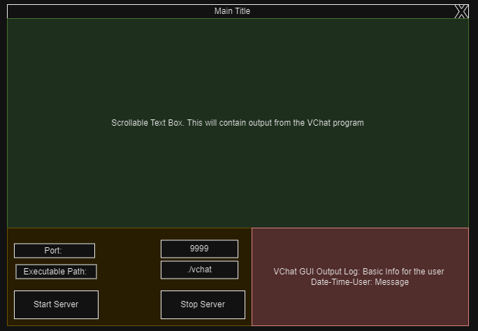
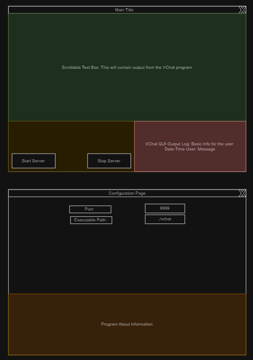

# VChat GUI
This is a project containing a simple Visual Studio Project to build a GUI for the VChat Server. This GUI can be used to start or stop a subprocesses that will be the VChat executable. Communication to and from the VChat program will be done through Unnamed Pipes.

## Features
1) View VChat output in a scrollable text window.
2) View VChat GUI output in a text window
3) Configure the port VChat will listen on
4) Configure the executable's location (Relative or Full?)

## Communication Flow Diagram

## Draft of GUI
There are two options as far as I can tell, one where we have one window with all the information, and one option where we attempt to split it up so we can add additional features more easily in the future.

### Single Page

This can be seen on the [Draw.io](https://drive.google.com/file/d/1CU2L2XudCIiL5FQXnOvMZWD7QYcEGNn8/view?usp=sharing) page.

We have one large window for the VChat output, this should be scrollable or not. There is not much in terms of useful output from VChat. If we make the output more structured with each user having a UUID, then we can add a Window that shows each currently active user.

We have a small sub-window which provides basic output from the VChat GUI (e.g. Successfully started VChat Server, etc)

We have a small sub window where we can use two text boxes to configure the port VChat will listen on and the location of the executable file that will be used to create the subprocess. Within this is also the start and stop server buttons.

### Multi Page

This can be seen on the [Draw.io](https://drive.google.com/file/d/1ehFUsemTxh047056X8BKzcX9mYMmVISs/view?usp=sharing) page.

We have one large window for the VChat output as was done in the Single page window. The same conditions and considerations stand, though with multiple windows are can allocate some space to tracking active users and connections.

We still maintain the small sub-window to display the VChat GUI output.

We also still maintain the Start and stop buttons but we move the configuration options to another page. This is if we want to include options where the GUI can compile (Using an installed MSVC compiler) the VChat program with a set of options that can be toggled with buttons or Checkboxes.

The second page would simply contain the About page information and the set of configuration options.

